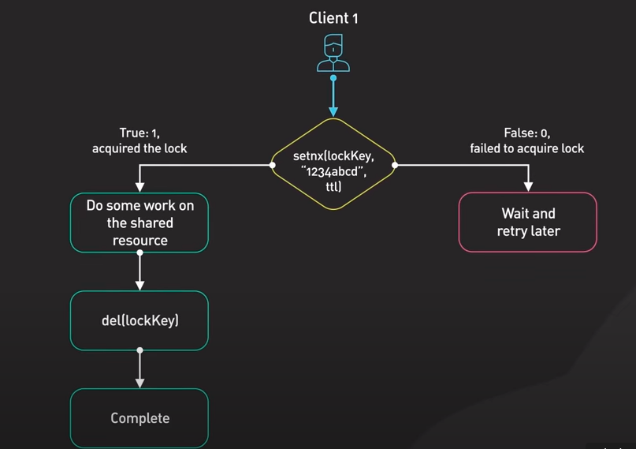
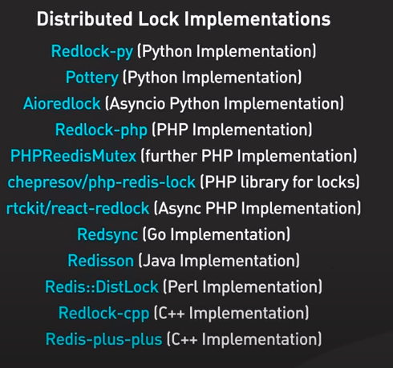

# Redis

## Introduction

Redis is a in-memory key-value store NoSql database. It is primarily used for caching.It supports strings, hashes,List,sets and sorted sets.

## Top Redis Use-cases

### Caching

### Session Store

Session ids are stored in redis and hence making the servers stateless. Since redis is in-memory once it crashes the data is lost to avoid we can persist the session info to disk which is time consuming so in production  replication is preferred.

### Distributed Lock

Used to get lock on shared redources. If available it returns 1 else 0 when the  setnx is used.



But the above implementation is not with issues so we can use exising implementation library



### Rate Limiters

Limit the number of requests per given interval using counter with TTL value. It can also be used to implement rate limiting algorithms such as the leaky bucket.

### Rank Leaderboards

Using sorted sets.Allows for retrieval in log time.

## Best Pratices when using redis

* Use namespaces to keep track of keys
* Keep the length of keys short
* Use `SCAN` instead of `KEYS`
* Use appropriate data structures
* Use Server-Side Lua Scripts

## Redis Insight
Used to visualize ,Analyse the redis database
**Downloads redis insight + redis server**
```bash
docker run -d --name redis-stack -p 6379:6379 -p 8001:8001 redis/redis-stack:latest
```

## References

* <https://www.youtube.com/watch?v=a4yX7RUgTxI&ab_channel=ByteByteGo>
* https://redis.io/docs/latest/operate/redisinsight/install/install-on-docker/
* https://medium.com/redis-with-raphael-de-lio/how-to-run-redis-locally-in-a-docker-container-and-manage-it-with-redis-insight-and-redis-cli-14b0af54e1d2
* https://redis.io/docs/latest/develop/tools/insight/
* https://redis.io/blog/5-key-takeaways-for-developing-with-redis/