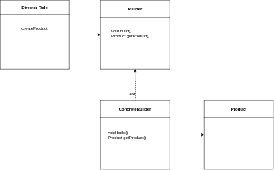

# Design Patterns

## Creational Design Patterns

Creational patterns deal with creation of objects from classes.

### Builder Pattern

Builder pattern has four components namely Director,Builder, ConcreteBuilder and Product. A main use-case of the builder pattern is when we need to create immutable objects in which case the Builder is defined inside the Product class and the product class has setters only with private access.



```java
package com.example.pricipleexample.builder;

public class Product {
    private int id;

    private String name;

    public int getId() {
        return id;
    }

    private void setId(int id) {
        this.id = id;
    }

    public String getName() {
        return name;
    }

    private void setName(String name) {
        this.name = name;
    }

    public static ProductBuilder getProductBuilder() {
        return new ProductConcreteBuilder();
    }

    public static interface ProductBuilder {
    
        ProductBuilder withId(int productId);
        ProductBuilder withProductName(String productName);
    
        void build();
    
        Product getProduct();
    }

    public static class ProductConcreteBuilder implements ProductBuilder {
        private String productName;
        private int id;
    
        private Product product;
        @Override
        public ProductBuilder withId(int productId) {
            this.id = productId;
            return null;
        }
    
        @Override
        public ProductBuilder withProductName(String productName) {
            this.productName = productName;
            return this;
        }
    
        @Override
        public void build() {
            this.product = new Product();
            product.setName(this.productName);
            product.setId(this.id);
        }
    
        @Override
        public Product getProduct() {
            return product;
        }
    }
}
```

The various methods in the Builder class return the builder instance itself so that we can use function chaining. The builder interface is optional.

#### Pitfalls

* Function chaining might be hard for begineers
* Partially initialized objects could be created if not used properly.

### Simple Factory Pattern

Used when based on a parameter return implementations , child classes. It will usually a static method to do so. It can also accept additional parameters which can be used to instantiate the object.

#### Implementation & Design Considerations

* Can be implemented by seperate class to avoid importing the implementation classes.

* Can use other patterns like builder pattern inside to build the necessary object.

#### Example

NumberFormat.getInstance

#### Code

```java
package com.example.pricipleexample.simplefactory;

public class SimpleFactory {
    public static Post createInstance(String type) {
        return switch (type) {
            case "travel" -> new TravelPost();
            case "blog" -> new BlogPost();
            default -> throw new IllegalArgumentException("Unknown type: " + type);
        };
    }
}

class Post {

}


class BlogPost extends Post {

}

class TravelPost extends Post {

}
```

#### Pitfall

The criteria used to determine the concrete implementation may become more complicated over time and it is a indication to use the Factory method instead.

## Structural Design Patterns

### Decorator Pattern
The **Decorator Pattern** is a structural design pattern used to dynamically add behavior and responsibilities to objects without modifying their code. It provides a flexible alternative to subclassing for extending functionality.

#### Intent
The intent of the Decorator Pattern is to:
1. Attach additional responsibilities to an object dynamically.
2. Provide a flexible alternative to subclassing for extending functionality.
3. Allow behavior to be added to individual objects, either statically or dynamically, without affecting the behavior of other objects from the same class.

#### Advantages
1. **Open/Closed Principle**: New functionality can be added to existing classes without modifying their structure.
2. **Single Responsibility Principle**: Functionality can be divided between classes with different areas of concern.
3. **Dynamic Composition**: You can combine decorators at runtime, offering a more flexible solution compared to inheritance.
4. **Reusability**: Decorators can be reused across different objects.

#### Disadvantages
1. **Complexity**: Adding many decorators can make the system more complex and harder to understand.
2. **Hard to Debug**: Multiple layers of decorators can make it difficult to trace the flow of control and behavior in the system.
3. **Decorators' Ordering**: The order in which decorators are applied can affect the behavior, leading to subtle bugs.

<details>
<summary>Code example for decorter pattern</summary>
** Example Code in Java**
Let’s consider a simple example where we have a `Coffee` interface with a basic implementation `SimpleCoffee`. We will add additional functionalities like adding milk or sugar to the coffee using the decorator pattern.

** Step 1: Create the Component Interface**
<code>
// Component interface
interface Coffee {
    String getDescription();
    double cost();
}
</code>

** Step 2: Create the Concrete Component**

// Concrete Component
class SimpleCoffee implements Coffee {
    @Override
    public String getDescription() {
        return "Simple Coffee";
    }

    @Override
    public double cost() {
        return 2.0;
    }
}

** Step 3: Create the Abstract Decorator **
// Abstract Decorator
abstract class CoffeeDecorator implements Coffee {
    protected Coffee decoratedCoffee;

    public CoffeeDecorator(Coffee coffee) {
        this.decoratedCoffee = coffee;
    }

    @Override
    public String getDescription() {
        return decoratedCoffee.getDescription();
    }

    @Override
    public double cost() {
        return decoratedCoffee.cost();
    }
}

** Step 4: Create Concrete Decorators **

// Concrete Decorator 1: Adds Milk
class MilkDecorator extends CoffeeDecorator {
    public MilkDecorator(Coffee coffee) {
        super(coffee);
    }

    @Override
    public String getDescription() {
        return decoratedCoffee.getDescription() + ", Milk";
    }

    @Override
    public double cost() {
        return decoratedCoffee.cost() + 0.5;
    }
}

// Concrete Decorator 2: Adds Sugar
class SugarDecorator extends CoffeeDecorator {
    public SugarDecorator(Coffee coffee) {
        super(coffee);
    }

    @Override
    public String getDescription() {
        return decoratedCoffee.getDescription() + ", Sugar";
    }

    @Override
    public double cost() {
        return decoratedCoffee.cost() + 0.2;
    }
}

** Step 5: Using the Decorators **

public class DecoratorPatternExample {
    public static void main(String[] args) {
        Coffee coffee = new SimpleCoffee();
        System.out.println(coffee.getDescription() + " $" + coffee.cost());

        // Add milk to the coffee
        coffee = new MilkDecorator(coffee);
        System.out.println(coffee.getDescription() + " $" + coffee.cost());

        // Add sugar to the coffee
        coffee = new SugarDecorator(coffee);
        System.out.println(coffee.getDescription() + " $" + coffee.cost());
    }
}

#### Output:

Simple Coffee $2.0
Simple Coffee, Milk $2.5
Simple Coffee, Milk, Sugar $2.7

### Explanation:
- **Component Interface (`Coffee`)**: Defines the interface for objects that can have responsibilities added to them.
- **Concrete Component (`SimpleCoffee`)**: The class to which additional functionality will be added.
- **Decorator (`CoffeeDecorator`)**: Maintains a reference to a `Coffee` object and defines an interface that conforms to `Coffee`'s interface.
- **Concrete Decorators (`MilkDecorator`, `SugarDecorator`)**: Adds responsibilities to the `Coffee` object by extending `CoffeeDecorator`.

This pattern allows for dynamic and flexible combinations of responsibilities, providing a powerful alternative to using extensive subclassing.
</details>
## Behavioural Design Patterns

### Strategy Pattern
The Strategy Design Pattern is a behavioral design pattern that enables an algorithm's behavior to be selected at runtime. It allows a family of algorithms to be defined, encapsulated, and made interchangeable, providing a way to change the algorithm or strategy used by a context object without altering its structure.

### Intent

The intent of the Strategy Design Pattern is to define a family of algorithms, encapsulate each one as an object, and make them interchangeable. The pattern allows the algorithm to vary independently from the clients that use it. This means that you can change the behavior of a context object at runtime by swapping out the strategy (algorithm) it uses.

### Components

1. **Strategy:** This is an interface or abstract class that defines the common interface for all concrete strategies.
2. **ConcreteStrategy:** These are concrete implementations of the Strategy interface. Each concrete strategy implements a specific algorithm or behavior.
3. **Context:** This class maintains a reference to a Strategy object and can switch between different strategies. It uses the Strategy object to execute the algorithm defined by that strategy.

### Example of Usage

Consider a scenario where you have a payment system that can use different payment methods such as credit card, PayPal, and Bitcoin. You can use the Strategy Pattern to handle these different payment methods in a flexible way.

### Sample Code in Java

Here’s a basic example illustrating the Strategy Design Pattern:

#### Strategy Interface

```java
public interface PaymentStrategy {
    void pay(int amount);
}
```

#### Concrete Strategies

```java
public class CreditCardPayment implements PaymentStrategy {
    private String cardNumber;

    public CreditCardPayment(String cardNumber) {
        this.cardNumber = cardNumber;
    }

    @Override
    public void pay(int amount) {
        System.out.println("Paying " + amount + " using Credit Card: " + cardNumber);
    }
}

public class PayPalPayment implements PaymentStrategy {
    private String email;

    public PayPalPayment(String email) {
        this.email = email;
    }

    @Override
    public void pay(int amount) {
        System.out.println("Paying " + amount + " using PayPal: " + email);
    }
}
```

#### Context

```java
public class ShoppingCart {
    private PaymentStrategy paymentStrategy;

    public void setPaymentStrategy(PaymentStrategy paymentStrategy) {
        this.paymentStrategy = paymentStrategy;
    }

    public void checkout(int amount) {
        paymentStrategy.pay(amount);
    }
}
```

#### Usage Example

```java
public class StrategyPatternDemo {
    public static void main(String[] args) {
        ShoppingCart cart = new ShoppingCart();

        // Paying with credit card
        PaymentStrategy creditCard = new CreditCardPayment("1234-5678-9876-5432");
        cart.setPaymentStrategy(creditCard);
        cart.checkout(100);

        // Paying with PayPal
        PaymentStrategy paypal = new PayPalPayment("user@example.com");
        cart.setPaymentStrategy(paypal);
        cart.checkout(200);
    }
}
```

### Advantages

1. **Flexibility:** Strategies can be switched at runtime, providing flexibility to change the behavior of the context object without altering its code.
2. **Separation of Concerns:** Algorithms are encapsulated in separate classes, adhering to the Single Responsibility Principle.
3. **Open/Closed Principle:** New strategies can be introduced without modifying existing code, adhering to the Open/Closed Principle.
4. **Code Reusability:** Common code for strategy execution is centralized in the context, while strategies focus solely on specific behaviors.

### Disadvantages

1. **Increased Number of Classes:** The pattern requires creating multiple classes (strategies), which might lead to a larger number of classes in the system.
2. **Complexity in Context:** The context class needs to be designed to work with multiple strategies, potentially increasing its complexity.
3. **Overhead:** For simple scenarios, the pattern might introduce unnecessary overhead and complexity compared to direct method implementations.

<details>
<summary>Usages in Java</summary>
The Strategy Design Pattern is a behavioral design pattern that enables an algorithm's behavior to be selected at runtime. It allows a family of algorithms to be defined, encapsulated, and made interchangeable, providing a way to change the algorithm or strategy used by a context object without altering its structure.

### Intent

The intent of the Strategy Design Pattern is to define a family of algorithms, encapsulate each one as an object, and make them interchangeable. The pattern allows the algorithm to vary independently from the clients that use it. This means that you can change the behavior of a context object at runtime by swapping out the strategy (algorithm) it uses.

### Components

1. **Strategy:** This is an interface or abstract class that defines the common interface for all concrete strategies.
2. **ConcreteStrategy:** These are concrete implementations of the Strategy interface. Each concrete strategy implements a specific algorithm or behavior.
3. **Context:** This class maintains a reference to a Strategy object and can switch between different strategies. It uses the Strategy object to execute the algorithm defined by that strategy.

### Example of Usage

Consider a scenario where you have a payment system that can use different payment methods such as credit card, PayPal, and Bitcoin. You can use the Strategy Pattern to handle these different payment methods in a flexible way.

### Sample Code in Java

Here’s a basic example illustrating the Strategy Design Pattern:

#### Strategy Interface

```java
public interface PaymentStrategy {
    void pay(int amount);
}
```

#### Concrete Strategies

```java
public class CreditCardPayment implements PaymentStrategy {
    private String cardNumber;

    public CreditCardPayment(String cardNumber) {
        this.cardNumber = cardNumber;
    }

    @Override
    public void pay(int amount) {
        System.out.println("Paying " + amount + " using Credit Card: " + cardNumber);
    }
}

public class PayPalPayment implements PaymentStrategy {
    private String email;

    public PayPalPayment(String email) {
        this.email = email;
    }

    @Override
    public void pay(int amount) {
        System.out.println("Paying " + amount + " using PayPal: " + email);
    }
}
```

#### Context

```java
public class ShoppingCart {
    private PaymentStrategy paymentStrategy;

    public void setPaymentStrategy(PaymentStrategy paymentStrategy) {
        this.paymentStrategy = paymentStrategy;
    }

    public void checkout(int amount) {
        paymentStrategy.pay(amount);
    }
}
```

#### Usage Example

```java
public class StrategyPatternDemo {
    public static void main(String[] args) {
        ShoppingCart cart = new ShoppingCart();

        // Paying with credit card
        PaymentStrategy creditCard = new CreditCardPayment("1234-5678-9876-5432");
        cart.setPaymentStrategy(creditCard);
        cart.checkout(100);

        // Paying with PayPal
        PaymentStrategy paypal = new PayPalPayment("user@example.com");
        cart.setPaymentStrategy(paypal);
        cart.checkout(200);
    }
}
```

### Advantages

1. **Flexibility:** Strategies can be switched at runtime, providing flexibility to change the behavior of the context object without altering its code.
2. **Separation of Concerns:** Algorithms are encapsulated in separate classes, adhering to the Single Responsibility Principle.
3. **Open/Closed Principle:** New strategies can be introduced without modifying existing code, adhering to the Open/Closed Principle.
4. **Code Reusability:** Common code for strategy execution is centralized in the context, while strategies focus solely on specific behaviors.

### Disadvantages

1. **Increased Number of Classes:** The pattern requires creating multiple classes (strategies), which might lead to a larger number of classes in the system.
2. **Complexity in Context:** The context class needs to be designed to work with multiple strategies, potentially increasing its complexity.
3. **Overhead:** For simple scenarios, the pattern might introduce unnecessary overhead and complexity compared to direct method implementations.

Overall, the Strategy Design Pattern is powerful for situations where an algorithm or behavior needs to be interchangeable and dynamic. It provides a clean way to separate concerns and promote flexibility and maintainability in your code.
</details>

## Reference
* chatgpt
