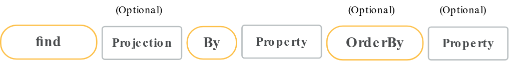

# Micronaut Data

## Introduction
Micronaut Data is a modern data access framework designed for building efficient and scalable applications. It integrates seamlessly with the Micronaut framework, leveraging its dependency injection and configuration capabilities.

### Top Features:

1. **Compile-Time Data Access**: Micronaut Data generates repositories and queries at compile time, improving performance and reducing runtime overhead.

2. **Support for Multiple Databases**: It supports various data sources, including SQL (e.g., H2, PostgreSQL, MySQL) and NoSQL (e.g., MongoDB).

3. **Repository Pattern**: Provides an easy-to-use repository pattern, allowing developers to define data access logic in a clean and maintainable way.

4. **Automatic Query Generation**: Allows developers to define queries using method names, which Micronaut Data translates into SQL automatically.

5. **Integration with Micronaut Features**: Fully integrates with Micronaut’s features like dependency injection, AOP, and configuration management.

6. **Reactive Support**: Offers reactive programming support, enabling non-blocking database access.

7. **Transaction Management**: Simplifies transaction management with built-in support for managing transactions declaratively.

## Comparison JDBC vs JPA
Here’s a comparative table highlighting the key differences between Micronaut Data JDBC and Micronaut Data JPA:

| Feature                    | Micronaut Data JDBC                           | Micronaut Data JPA                                    |
|----------------------------|-----------------------------------------------|-------------------------------------------------------|
| **Access Method**          | Direct JDBC                                   | JPA (Java Persistence API)                            |
| **Abstraction Level**      | Low-level access                              | High-level ORM abstraction                            |
| **Performance**            | Typically faster due to minimal overhead      | May have slightly higher overhead due to ORM features |
| **Query Generation**       | Compile-time query generation                 | Supports JPQL and Criteria API for queries            |
| **Complexity**             | Simpler, straightforward CRUD operations      | Better suited for complex relationships               |
| **Entity Management**      | No built-in entity management                 | Provides entity lifecycle management                  |
| **Relationship Handling**  | Manual handling of relationships              | Automatic handling of relationships                   |
| **Transaction Management** | Basic transaction support                     | Advanced transaction management features              |
| **Use Cases**              | Best for simple data models, high performance | Ideal for complex domain models and relationships     |
| **Learning Curve**         | Easier for developers familiar with JDBC      | May require more understanding of JPA concepts        |

This table provides a clear comparison to help in deciding which option to use based on specific project requirements.
## Common

### Repository Interfaces
Use `@Repository`
The built-in Repository interfaces are
```
GenericRepository   
│
├── CrudRepository
│   |── JpaRepository
|   |── PageableRepository
│
├── AsyncCrudRepository
│   └── AsyncPageableRepository
│ 
├── ReactiveStreamsCrudRepository
│   └── ReactiveStreamsPageableRepository
├── ReactorCrudRepository
│   └── ReactorPageableRepository
│
├── RxJavaCrudRepository
│   
├── CoroutineCrudRepository
    └── CoroutinePageableCrudRepository
```
### Validation
Validation can be done Jakarta Validation annotations 

### Querying

Instead of find,  you can also use search, query, get, read or retrieve.
The return types supported are 
* Entity Object
* List<>
* Stream <>
* Option<>
* Page
* Slice
* Future or CompletableFuture
* Publisher ( reactive)
* Primitives

Micronaut JDBC and R2DBC supports cursor pageable.

#### `@Where`
Allows additional filtering to the generated query as in the case of soft deletes.

#### Entity Timestamps
Micronaut data supports `@DateCreated`, `@DateUpdated` to maintain audits etc.

#### Entity Events
`@PrePersist`, `@PostPersist`, `@PostRemove`, `@PreRemove`, `@PreUpdate`, `@PostUpdate`.

### Multi-tenancy
Micronaut allows the use of multiple databases ,schemas or even the same table (with discriminator column ) for multi-tenant applications.

## Micronaut JDBC and R2DBC
It has support for
* Json column
* Column transformation

## References

* https://micronaut-projects.github.io/micronaut-data/latest/guide/
* Chatgpt