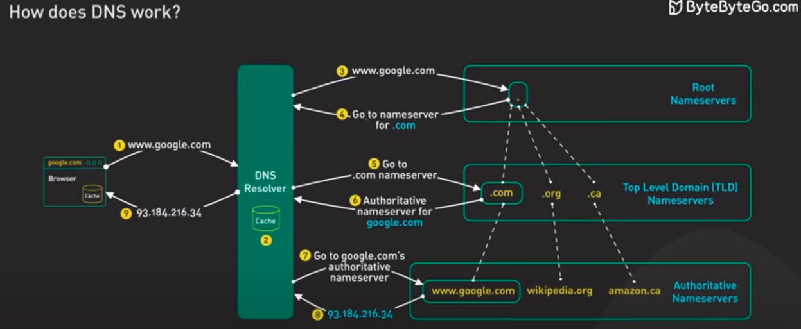

# DNS (Domain Name Server)

## Inroduction

DNS translates the human understood domain name to IP address understood by the machine.

* First , when we type the url , browser will check if it is present in browser cache , if not
* Then , it will ask the OS which will check its cache if not
* The request will be sent to DNS Resolver (which is provided by ISP)
* It will forwarded to root server (13 root servers)
* It will sent to TLD Name Server (.com) and sent authoritative server for url
* Go to urls authoritative server and get the IP.

> Note : Since it is decentralized it is highly fault tolerant

## Reference

* <https://www.youtube.com/watch?v=27r4Bzuj5NQ&ab_channel=ByteByteGo>
